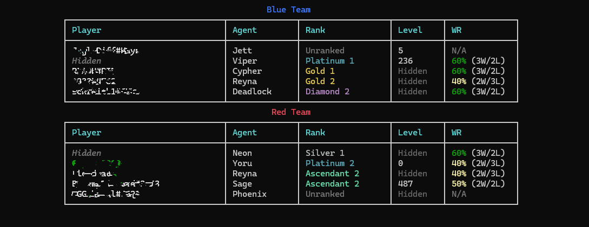

<p align="center">
  
</p>

<h1 align="center">ValRadar</h1>

<p align="center">
  <strong>Your live Valorant companion, right in your terminal.</strong><br/>
  Get instant visibility into ranks, agents, win rates, and lobby updates for everyone in your game!
</p>

<p align="center">
  
  
  
</p>

---

## What is ValRadar?

Have you ever wanted a quick overview of who you're playing with, without alt-tabbing to a third-party tracker site? ValRadar hooks into your local Riot Client to pull real-time stats and match info, displaying it all directly in a sleek terminal UI. 

Whether you're waiting in the lobby or loading into a match, it updates instantly based on what's happening in-game.

| When you're in... | Here's what you get |
| ----------------- | ------------------- |
| **The Lobby**     | See who's in your party, their ranks, levels, ready states, and recent win/loss rates. |
| **Agent Select**  | Keep track of your team's agent picks, connection states, and stats while everyone locks in. |
| **The Match**     | Full overview of both teams! Check out exactly who you're up against. |

Because we listen to Riot's local WebSocket, these updates happen the second your game changes state. No annoying refresh delays!

## Cool Features

- **Instant game phase updates:** Moving from the lobby to a match? ValRadar knows right away and updates the screen.
- **Rank & MMR fetching:** We pull competitive ranks through the official endpoints, with smart caching so everything stays snappy.
- **Recent W/R tracking:** Easily spot how your teammates did in their last 5 competitive matches.
- **Auto-magic authentication:** Keep playing for hours! We handle token refreshes under the hood, so you never have to restart the app.
- **Privacy matters:** If a player hides their name or level in-game, ValRadar respects that.
- **Discord presence:** Show off your current lobby or match status directly on your Discord profile!
- **Play nice with rate limits:** The built-in HTTP layer naturally recovers from auth hiccups and ensures we don't spam Riot's servers.

## See it in action



## Getting Started

### What you need
- **Windows 10 or 11** (since we hook into the local Windows Riot Client)
- **.NET 10.0 SDK** (or newer)
- **Valorant** needs to be running (we use its lockfile for local authorization)

### Installation
Grab the code and build it via your terminal:

```bash
git clone https://github.com/jonasradke-dev/ValRadar.git
cd ValRadar
dotnet build
```

### How to use it
1. Boot up Valorant and wait until you hit the main menu.
2. Fire up ValRadar:
   ```bash
   dotnet run
   ```
3. (Optional) If you'd rather build a simple standalone executable to share or run easily later:
   ```bash
   dotnet publish -c Release -r win-x64 --self-contained -p:PublishSingleFile=true -o ./out
   ./out/ValRadar.exe
   ```

That's it! ValRadar will automatically sync with your game phase.

## Peek under the hood

For the curious developers out there, ValRadar uses a layered HTTP pipeline that makes managing Riot's authorization super smooth. We use custom `DelegatingHandler`s to process the requests:

```text
HttpClient
└─ TokenRefreshHandler     ← Oops, 401/400? This refreshes Riot tokens automatically!
   └─ RiotAuthHandler      ← Injects your current entitlement and auth headers.
      └─ HttpClientHandler
```

A central `RiotAuthService` manages the authentication state. When tokens refresh, those changes are immediately available to every API request still in flight. 

We catch game updates through the local Riot WebSocket and rely on remote endpoints (`pd.{shard}.a.pvp.net` and `glz-{region}-1.{shard}.a.pvp.net`) to grab player stats. To stay friendly with rate limits, ValRadar aggressively caches data (like ranks and match history).

### The Code Setup

```text
ValRadar/
├── Auth/                       Takes care of the HTTP pipeline & logins
│   ├── RiotAuthService.cs       
│   ├── RiotAuthHandler.cs       
│   ├── TokenRefreshHandler.cs   
│   └── ...
├── RiotClient/                 Hooks into your local client
│   ├── LockfileReader.cs        Finds your password/port for local requests
│   ├── RegionResolver.cs        Figures out your region from log files
│   └── ...
├── Services/                   The heavy lifters
│   ├── ValorantApiService.cs    Talks to external Riot servers
│   ├── GameDisplayService.cs    Paints the terminal UI with Spectre.Console
│   ├── DiscordRPCService.cs     Tells Discord what you're up to
│   └── RiotWebSocketService.cs  Listens for live game events
└── Program.cs
```

## Huge thanks to

- [Spectre.Console](https://spectreconsole.net/) for making terminal UIs actually look amazing.
- [techchrism's valorant-api-docs](https://github.com/techchrism/valorant-api-docs) for breaking down Riot's web APIs.
- [valorant-api.com](https://valorant-api.com/) for building such an awesome public asset API.

## A quick disclaimer

ValRadar isn't officially affiliated with, endorsed by, or sponsored by Riot Games, Inc. VALORANT and all related logos and characters are property of Riot Games, Inc.

This is simply a passionate community project! It doesn't modify game files, won't get you banned, and only reads data your client is already allowed to view. Use it and enjoy!

## License

MIT — check out the [LICENSE](LICENSE) file for more info.
