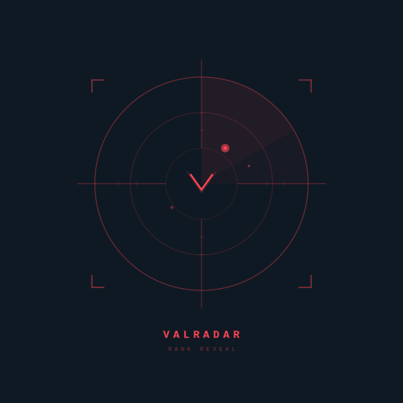

<p align="center">
  
</p>

<h1 align="center">ValRadar</h1>

<p align="center">
  <strong>Real-time Valorant lobby & match tracker for your terminal.</strong><br/>
  See ranks, agents, win rates, and lobby state for every player — directly in your shell.
</p>

<p align="center">
  
  
  
</p>

---

## What it does

ValRadar connects to the local Riot Client API and Valorant's remote endpoints
to display player information in real time, directly in your terminal.

| Phase            | What you see                                                 |
| ---------------- | ------------------------------------------------------------ |
| **Lobby**        | Party members with rank, level, ready status, recent W/R     |
| **Agent Select** | Your team's picks, ranks, levels, lock status, recent W/R    |
| **In Game**      | Both teams with agents, ranks, levels, recent W/R            |

Phase transitions are detected instantly via WebSocket — no polling delay.

## Features

- **Live phase detection** — WebSocket-based, reacts instantly to lobby → agent select → in-game transitions
- **Rank & MMR lookup** — Fetches competitive tier from Riot's MMR endpoint, with smart caching
- **Recent W/R indicator** — Shows last 5 competitive matches win/loss ratio per player
- **Automatic token refresh** — Long sessions stay authenticated; no restarts needed
- **Privacy-respecting** — Honors Incognito mode and hidden levels
- **Discord Rich Presence** — Reflects current game state in your Discord profile
- **Resilient HTTP layer** — Auto-recovers from auth failures and respects rate limits

## Screenshot

```
                 ╔═══════════════════════════════╗
                 ║        V A L R A D A R        ║
                 ╚═══════════════════════════════╝
                            Party Lobby
   ┌──────────────────────┬────────────┬───────┬───────┬──────────────┐
   │ Player               │ Rank       │ Level │ Ready │ WR           │
   ├──────────────────────┼────────────┼───────┼───────┼──────────────┤
   │ Player1#TAG (Owner)  │ Platinum 2 │ 318   │ Yes   │ 60% (3W/2L)  │
   │ Player2#TAG          │ Platinum 1 │ 128   │ Yes   │ 40% (2W/3L)  │
   └──────────────────────┴────────────┴───────┴───────┴──────────────┘
```

## Requirements

- **Windows 10/11** (uses the local Riot Client API)
- **.NET 10.0 SDK** or later
- **Valorant** must be running (lockfile required for authentication)

## Installation

```bash
git clone https://github.com/jonasradke-dev/ValRadar.git
cd ValRadar
dotnet build
```

## Usage

1. Launch Valorant and wait until you're in the lobby
2. Run ValRadar:
   ```bash
   dotnet run
   ```
3. Or build a self-contained executable:
   ```bash
   dotnet publish -c Release -r win-x64 --self-contained -p:PublishSingleFile=true -o ./out
   ./out/ValRadar.exe
   ```

ValRadar automatically detects your game phase and displays the appropriate view.

## How it works

ValRadar uses a layered HTTP pipeline with custom `DelegatingHandler`s:

```
HttpClient
└─ TokenRefreshHandler     ← catches 401/400, refreshes Riot tokens automatically
   └─ RiotAuthHandler      ← injects current entitlement + auth headers
      └─ HttpClientHandler
```

Auth state is held by a single `RiotAuthService` and read live by the handler
chain — refreshes propagate immediately to all in-flight components.

Phase detection runs over Riot's local WebSocket; API calls go to the remote
PD (`pd.{shard}.a.pvp.net`) and GLZ (`glz-{region}-1.{shard}.a.pvp.net`)
clusters. Player data (rank, names, match history) is cached aggressively with
TTL-based invalidation to stay well below Riot's rate limits.

## Project structure

```
ValRadar/
├── Auth/                       Authentication & HTTP pipeline
│   ├── RiotAuthService.cs       Token state + refresh orchestration
│   ├── RiotAuthHandler.cs       Header injection
│   ├── TokenRefreshHandler.cs   Automatic re-auth on 401/400
│   └── ...
├── RiotClient/                 Local Riot Client integration
│   ├── LockfileReader.cs        Parses lockfile for local API auth
│   ├── RegionResolver.cs        Extracts region from ShooterGame.log
│   └── ...
├── Services/
│   ├── ValorantApiService.cs    Remote PD/GLZ endpoints
│   ├── GameDisplayService.cs    Spectre.Console rendering
│   ├── DiscordRPCService.cs     Discord Rich Presence
│   └── RiotWebSocketService.cs  Phase event listener
└── Program.cs
```

## Credits

- [Spectre.Console](https://spectreconsole.net/) — terminal UI framework
- [techchrism's valorant-api-docs](https://github.com/techchrism/valorant-api-docs) — endpoint documentation
- [valorant-api.com](https://valorant-api.com/) — public asset and version API

## Disclaimer

ValRadar is not affiliated with, endorsed, sponsored, or specifically approved
by Riot Games, Inc. or any of its affiliates. VALORANT and all related logos,
characters, names, and distinctive likenesses are the exclusive property of
Riot Games, Inc.

This is an unofficial, community-built tool that uses the local Riot Client
API. It does not modify the game in any way and only reads data that the
official client also retrieves. Use at your own discretion.

## License

MIT — see [LICENSE](LICENSE) for details.
